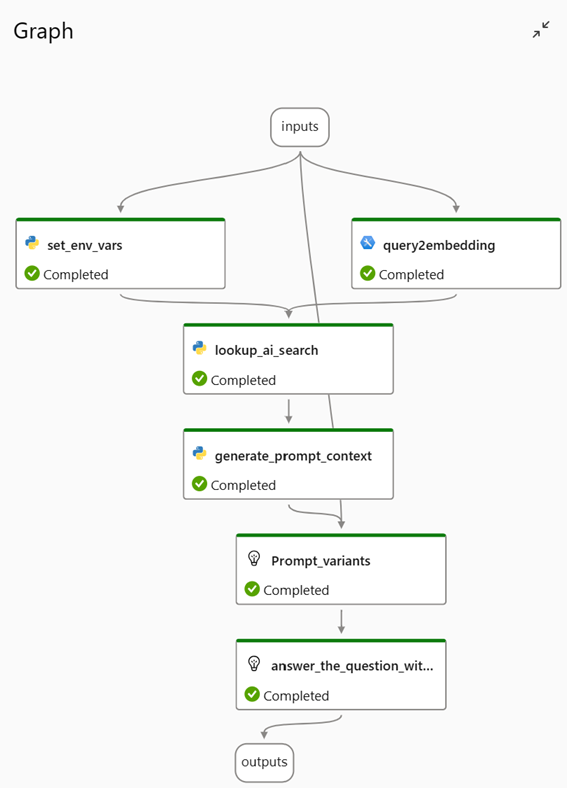

# Azure Machine Learning prompt flow

## Bring your own data QnA

This sample demonstrates Q&A application powered by GPT.  You can ask a wide range of questions related to Azure Machine Learning and receive responses. The process involves embedding the raw query, using Azure AI Search (vector search) to find most relevant context in user data, and then using GPT to chat with you with the documents.

## What you will learn

In this flow, you will learn

* how to compose a Q&A system flow.
* how to use vector search tool to find relevant documents and leverage domain knowledge.
* how to tune prompt with variants.

## Prerequisites

- Azure Maching Learning Workspace > Prompt flow: [quick-start](https://learn.microsoft.com/en-us/azure/machine-learning/how-to-use-retrieval-augmented-generation) / [github.io](https://microsoft.github.io/promptflow)
  - Connection: Azure OpenAI or OpenAI connection, with the availability of chat/completion and embedding models/deployments.
  - Environment Variables: Set the your API keys in `env_var.config`.
- Search Index: Create Azure AI Search Index with vector data. 
  - Python SDK sample code: [git](https://github.com/Azure/azure-sdk-for-python) > `sdk/search/azure-search-documents`

## Tools used in this flow

* LLM tool
* Embedding tool
* Python tool (Vector Index Lookup)

## Generated flow graph

